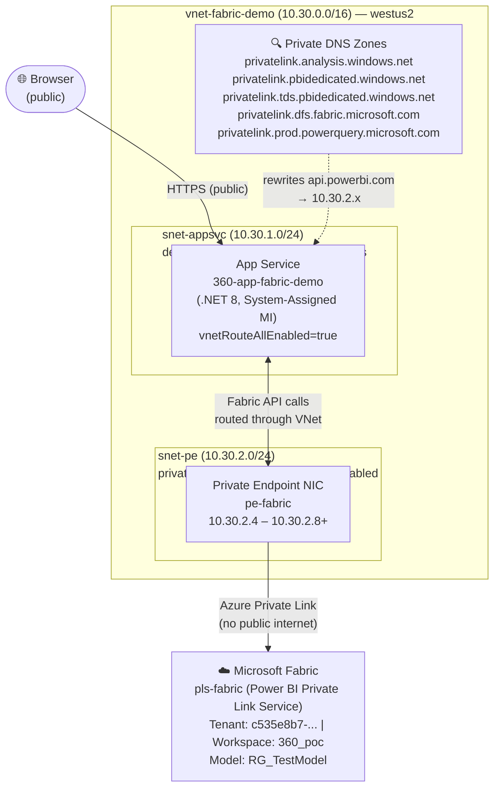
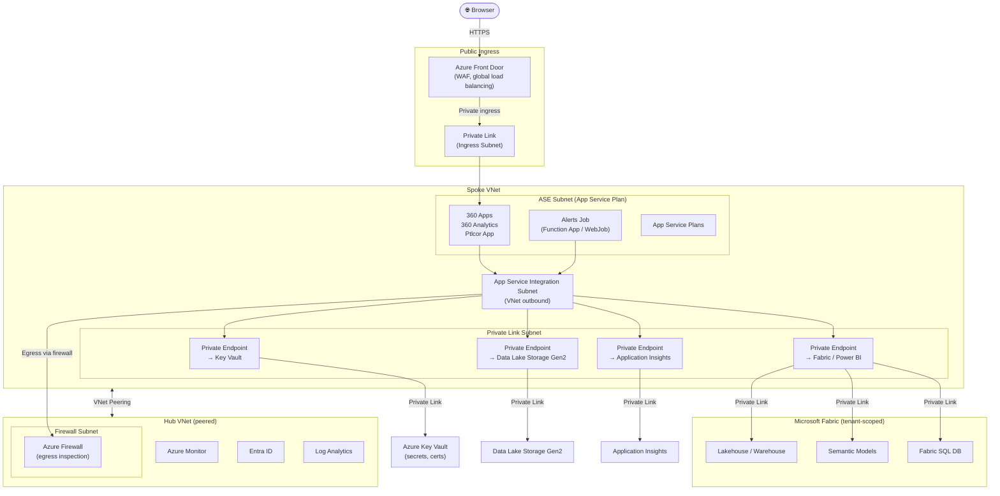

# Customer Email — ASP.NET Core Web App connecting to Microsoft Fabric over a Private Endpoint

**Subject:** End-to-end: ASP.NET Core web app connecting to Microsoft Fabric over a Private Endpoint — architecture, steps, and scripts

Hi <Customer>,

As promised, below is a complete write-up of how we made the demo ASP.NET Core 8 web app (`360-app-fabric-demo`) talk to a Microsoft Fabric semantic model (`360_poc / RG_TestModel`) **entirely over a Private Endpoint**, with no traffic to Fabric leaving the Azure backbone. I've included every Azure resource, every CLI command, the Bicep template, the validation scripts, and the proofs we used to confirm the path.

If you want to reproduce this in your own subscription, the only things you change are the names/IDs in the "Parameters" block.

---

## 1. Target architecture

```text
                ┌────────────────────────────────────────────────────────────┐
                │  vnet-fabric-demo (10.30.0.0/16)  — region: westus2        │
                │                                                            │
                │   ┌────────────────────────┐    ┌────────────────────────┐ │
   Browser  ──▶ │   │ snet-appsvc            │    │ snet-pe                │ │
   (public)     │   │ 10.30.1.0/24           │    │ 10.30.2.0/24           │ │
                │   │ delegated to           │    │ (Private Endpoint NIC) │ │
                │   │ Microsoft.Web/         │    │                        │ │
                │   │ serverFarms            │    │  pe-fabric NIC IPs:    │ │
                │   │                        │    │   10.30.2.4 api...     │ │
                │   │  App Service           │    │   10.30.2.5 *.pbi...   │ │
                │   │  (VNet-integrated,     │◀──▶│   10.30.2.6 *.app...   │ │
                │   │  vnetRouteAllEnabled)  │    │   10.30.2.7 mwc-global │ │
                │   │  System-Assigned MI    │    │   10.30.2.8 onelake    │ │
                │   └────────────────────────┘    │   …                    │ │
                │                                 └────────────────────────┘ │
                │                                                            │
                │   Private DNS zones linked to this VNet:                   │
                │     privatelink.analysis.windows.net                       │
                │     privatelink.pbidedicated.windows.net                   │
                │     privatelink.tds.pbidedicated.windows.net               │
                │     privatelink.dfs.fabric.microsoft.com                   │
                │     privatelink.prod.powerquery.microsoft.com              │
                └────────────────────────────────────────────────────────────┘
                                          │
                                          │  (Microsoft backbone, no public hop)
                                          ▼
                          ┌───────────────────────────────────┐
                          │  Microsoft.PowerBI/                │
                          │   privateLinkServicesForPowerBI    │
                          │   pls-fabric (groupId='tenant')    │
                          │   → Fabric tenant                  │
                          │   c535e8b7-9ab5-4ff9-870c-0d…      │
                          └───────────────────────────────────┘
```

Key idea: the App Service is regional-VNet-integrated into `snet-appsvc`, all outbound traffic is forced into the VNet (`vnetRouteAllEnabled=true`), and the Private DNS zones linked to that VNet rewrite Fabric/Power BI FQDNs to the Private Endpoint NIC IPs in `snet-pe`. Result: the app's calls to `api.powerbi.com`, `*.analysis.windows.net`, `onelake.dfs.fabric.microsoft.com`, etc. resolve to `10.30.2.x` and travel over Azure Private Link only.



---

## 2. Parameters (substitute your own)

| Item | Value used in demo |
|---|---|
| Subscription | `ME-MngEnvMCAP203998-sbodhankar-1` (`6dad7b6f-2e7c-4911-aa3e-2ac5885ee0e8`) |
| Entra tenant | `c535e8b7-9ab5-4ff9-870c-0d95cb4cb1c6` |
| Resource group | `rg-test-group` |
| Region | `westus2` |
| VNet | `vnet-fabric-demo` (`10.30.0.0/16`) |
| Subnet (App Service) | `snet-appsvc` (`10.30.1.0/24`), delegated to `Microsoft.Web/serverFarms` |
| Subnet (Private Endpoint) | `snet-pe` (`10.30.2.0/24`), `privateEndpointNetworkPolicies=Disabled` |
| App Service | `360-app-fabric-demo` (.NET 8) |
| Private Endpoint | `pe-fabric` (groupId `tenant`) |
| Private Link Service | `pls-fabric` (Microsoft.PowerBI/privateLinkServicesForPowerBI, `location: 'global'`) |
| Fabric workspace | `360_poc` (`df43ae37-a2c1-4d26-8c38-e812ba66b0fd`) |
| Fabric semantic model | `RG_TestModel` (`e440e7ad-af3e-45c5-b044-9f58024edbaa`) |

---

## 3. Step-by-step build

All commands are PowerShell / Azure CLI (`az` v2.60+). Run `az login` and `az account set --subscription <id>` first.

### 3.1 Create the resource group, VNet, and two subnets

```powershell
$RG="rg-test-group"; $LOC="westus2"; $VNET="vnet-fabric-demo"
az group create -n $RG -l $LOC

az network vnet create `
  -g $RG -n $VNET -l $LOC `
  --address-prefixes 10.30.0.0/16 `
  --subnet-name snet-appsvc --subnet-prefix 10.30.1.0/24

# App Service Regional VNet Integration requires a delegated subnet
az network vnet subnet update -g $RG --vnet-name $VNET -n snet-appsvc `
  --delegations Microsoft.Web/serverFarms

# Private Endpoint subnet (must disable PE network policies)
az network vnet subnet create -g $RG --vnet-name $VNET -n snet-pe `
  --address-prefixes 10.30.2.0/24 `
  --disable-private-endpoint-network-policies true
```

### 3.2 (Optional) NSGs

For a demo, default NSG-less subnets work. For production, attach an NSG to each subnet allowing:

- `snet-appsvc` outbound: `Allow VirtualNetwork→VirtualNetwork on 443/1433/TCP` (for XMLA), default `AzureCloud` deny, default outbound internet `Deny` (since `vnetRouteAllEnabled=true` will force everything through the VNet anyway).
- `snet-pe` inbound: `Allow VirtualNetwork→VirtualNetwork on 443/1433/TCP`.

Sample:

```powershell
az network nsg create -g $RG -n nsg-snet-pe -l $LOC
az network nsg rule create -g $RG --nsg-name nsg-snet-pe -n allow-vnet-https `
  --priority 100 --access Allow --protocol Tcp `
  --source-address-prefixes VirtualNetwork --destination-address-prefixes VirtualNetwork `
  --destination-port-ranges 443 1433 --direction Inbound
az network vnet subnet update -g $RG --vnet-name $VNET -n snet-pe --network-security-group nsg-snet-pe
```

### 3.3 Create the Fabric Private DNS zones and link them to the VNet

Fabric uses **five** privatelink zones. Create them empty; the PE's DNS zone group will populate the A records.

```powershell
$ZONES = @(
  'privatelink.analysis.windows.net',
  'privatelink.pbidedicated.windows.net',
  'privatelink.tds.pbidedicated.windows.net',
  'privatelink.dfs.fabric.microsoft.com',
  'privatelink.prod.powerquery.microsoft.com'
)
foreach ($z in $ZONES) {
  az network private-dns zone create -g $RG -n $z | Out-Null
  az network private-dns link vnet create -g $RG -z $z `
    -n "link-$VNET" --virtual-network $VNET --registration-enabled false | Out-Null
}
```

### 3.4 Create the App Service and System-Assigned Managed Identity

```powershell
$APP="360-app-fabric-demo"; $PLAN="asp-$APP"
az appservice plan create -g $RG -n $PLAN --sku P1v3 --is-linux false
az webapp create -g $RG -p $PLAN -n $APP --runtime "dotnet:8"

# Enable system-assigned MI (the app uses DefaultAzureCredential → ManagedIdentityCredential)
az webapp identity assign -g $RG -n $APP
```

In the Fabric admin portal, add this MI as a **Member** of the `360_poc` workspace, and ensure tenant settings *"Service principals can use Fabric APIs"* and *"Allow XMLA endpoints"* are enabled (scoped to a security group containing the MI).

### 3.5 Regional VNet Integration + force all traffic through the VNet

```powershell
az webapp vnet-integration add -g $RG -n $APP --vnet $VNET --subnet snet-appsvc

# This was the critical step. `az webapp config set --vnet-route-all-enabled`
# and `az resource update` were unreliable for us; a direct ARM PATCH worked:
$sub = az account show --query id -o tsv
$uri = "https://management.azure.com/subscriptions/$sub/resourceGroups/$RG/providers/Microsoft.Web/sites/$APP/config/web?api-version=2024-04-01"
az rest --method PATCH --uri $uri --body '{"properties":{"vnetRouteAllEnabled":true}}'
```

### 3.6 Deploy the Private Endpoint + Power BI PLS via Bicep

The whole PE/PLS/DNS-zone-group package is in `infra/pe-fabric.bicep`. It creates:

- `Microsoft.PowerBI/privateLinkServicesForPowerBI@2020-06-01` (location: `global`, scoped to the Fabric tenant GUID).
- `Microsoft.Network/privateEndpoints` with a **manual** connection (Fabric admin must approve), `groupIds = ['tenant']`.
- `privateDnsZoneGroups` binding the PE NIC to all five zones so A records auto-register.

Deploy:

```powershell
$SUBNET_ID = az network vnet subnet show -g $RG --vnet-name $VNET -n snet-pe --query id -o tsv
$TENANT    = az account show --query tenantId -o tsv

az deployment group create -g $RG `
  --template-file .\infra\pe-fabric.bicep `
  --parameters subnetId=$SUBNET_ID fabricTenantId=$TENANT
```

> **Why a separate `pls-fabric` resource?** Our first attempt referenced the tenant-scoped Power BI PLS by ID directly (`/providers/Microsoft.PowerBI/privateLinkServicesForPowerBI/<tenantId>`). That path doesn't exist as an addressable resource — you have to **create** the `Microsoft.PowerBI/privateLinkServicesForPowerBI` resource yourself with `location: 'global'` and the tenant GUID in its properties, and then point the PE at *that* resource's `id`. Once we did that, the PE provisioned and showed up in the Fabric admin portal for approval.

### 3.7 Tenant-admin approval (one-time, manual)

A Fabric tenant admin opens **Fabric admin portal → Tenant settings → Azure Private Link → Approve pending requests**, finds the request named `fabric-conn` with message `Fabric PE for 360-app-fabric-demo`, and approves it. Within ~30 seconds the PE connection state flips `Pending → Approved` and the five DNS zones get A records.

CLI to check connection state at any time:

```powershell
az network private-endpoint show -g $RG -n pe-fabric `
  --query "manualPrivateLinkServiceConnections[0].privateLinkServiceConnectionState"
```

Typical populated A records after approval:

| FQDN | IP |
|---|---|
| `api.privatelink.analysis.windows.net` | `10.30.2.4` |
| `*.pbidedicated...` | `10.30.2.5` |
| `app.privatelink.analysis.windows.net` | `10.30.2.6` |
| `mwc-global.privatelink.analysis.windows.net` | `10.30.2.7` |
| `onelake.privatelink.pbidedicated.windows.net` | `10.30.2.8` |
| `*.tds.pbidedicated...`, `*.dfs.fabric...` | populate on first use |

### 3.8 Build and deploy the app

The app uses ADOMD.NET 19.84.1 + Azure.Identity 1.14.1 with `DefaultAzureCredential`. Connection string:

```text
Data Source=powerbi://api.powerbi.com/v1.0/myorg/360_poc;Initial Catalog=RG_TestModel
```

Build, publish, zip, deploy (basic auth on SCM is disabled — `az webapp deploy` uses an AAD bearer token):

```powershell
dotnet publish .\FabricDemoApp.csproj -c Release -o .\publish
Compress-Archive -Path .\publish\* -DestinationPath .\publish.zip -Force
az webapp deploy -g $RG -n $APP --src-path .\publish.zip --type zip
```

---

## 4. How we proved the connection actually goes over the Private Endpoint

Two independent checks, captured live during testing.

**A. DNS from inside the App Service (via Kudu `/api/command`, AAD-authenticated):**

```text
api.privatelink.analysis.windows.net           → 10.30.2.4   (PE NIC)
onelake.privatelink.pbidedicated.windows.net   → 10.30.2.8   (PE NIC)
content.powerapps.com                          → 13.107.246.70  (public — not in PE scope, as expected)
```

DNS server reported: `168.63.129.16` (Azure VNet DNS, which honors the linked Private DNS zones).

**B. Same hostnames from a public DNS server (laptop, `8.8.8.8`):**

```text
api.powerbi.com                       → 20.42.131.40   (public Azure IP)
onelake.dfs.fabric.microsoft.com      → 20.42.131.149  (public Azure IP)
```

`10.30.2.x` is RFC1918 — unreachable from the internet. The fact that the app resolves Fabric FQDNs to those addresses, combined with `vnetRouteAllEnabled=true`, means egress to Fabric **cannot** take a public path.

**C. App functional proof:** the three demo pages all return data:

- `/Index` — XMLA via ADOMD → DAX `SUMX(...)` → **Total NextFY: 5,120,500.00**
- `/IndexDataTable` — XMLA via ADOMD → `COUNTROWS('Table')` → 31
- `/IndexRestApi` — Power BI REST API → 31 rows

Before the PE existed, all three failed with: `HTTP Error: No such host is known. (api.powerbi.com:443)`. Once the PE + zones were in place and `vnetRouteAllEnabled` was set, every page worked on the first request.

---

## 5. Gotchas we hit (so you don't have to)

1. **`vnetRouteAllEnabled` doesn't stick via `az webapp config set` or `az resource update`.** Use a direct ARM PATCH on `…/config/web?api-version=2024-04-01` (script in §3.5). Without this, only RFC1918 destinations route through the VNet, so public Fabric IPs would be tried first.
2. **Power BI PLS must be created explicitly.** You cannot reference `/providers/Microsoft.PowerBI/privateLinkServicesForPowerBI/<tenantId>` as a pre-existing resource. Provision `Microsoft.PowerBI/privateLinkServicesForPowerBI@2020-06-01` with `location: 'global'` and the tenant GUID, then point the PE at its `id`.
3. **All five private DNS zones are required**, even if only some get records initially. `*.tds.pbidedicated...` and `*.dfs.fabric...` only populate when you first hit SQL endpoints / OneLake.
4. **Fabric tenant admin approval is mandatory** for `groupId='tenant'` PEs. The PE will sit in `Pending` indefinitely without it.
5. **Managed Identity → Fabric workspace membership** is separate from Azure RBAC. Add the MI as a Member of the workspace in the Fabric portal, and enable the relevant tenant settings (XMLA endpoints, service principal API access).
6. **SCM basic auth disabled** is the secure default. Use `az webapp deploy` (AAD bearer) rather than zip-deploy with publishing-profile credentials.
7. **Power BI REST error bodies** come back in `$_.ErrorDetails.Message`, not `$_.Exception.Message`, when calling from PowerShell. Worth remembering when scripting validation.

---

## 6. Files we used (attached / available on request)

- `infra/pe-fabric.bicep` — full PE + PLS + DNS zone group template.
- `Program.cs`, `Pages/Index.cshtml.cs`, `Pages/IndexDataTable.cshtml.cs`, `Pages/IndexRestApi.cshtml.cs` — app code (XMLA + REST patterns).
- `verify-dns.ps1` / `verify-app.ps1` / `inspect-model.ps1` — validation helpers used in §4.
- `set-route-all.ps1` — the ARM PATCH workaround for `vnetRouteAllEnabled`.

---

## 7. Manual Portal Steps (Alternative to CLI/Scripts)

If you prefer creating resources through the Azure portal UI instead of CLI commands, here's the step-by-step walkthrough.

### What we're building

We're configuring an **ASP.NET Core Web App** to connect to **Microsoft Fabric** (Power BI semantic models) **entirely over a Private Endpoint** — no traffic leaves the Azure backbone.

**The flow:**
1. **VNet with two subnets** — one for the App Service (VNet-integrated), one for the Private Endpoint NIC
2. **App Service** with a System-Assigned Managed Identity, integrated into the VNet with "route all traffic" enabled
3. **Power BI Private Link Service** — the target resource that exposes Fabric/Power BI over Private Link
4. **Private Endpoint** — connects your VNet to the Power BI PLS, with DNS zones that rewrite Fabric FQDNs (e.g., `api.powerbi.com`) to private IPs (`10.30.2.x`)
5. **Fabric workspace access** — grant the Managed Identity permission to query the semantic model

**Result:** When your app calls `api.powerbi.com` or `*.analysis.windows.net`, DNS resolves to the Private Endpoint's private IP, and all traffic flows over Azure Private Link — never touching the public internet.

---

### 7.1 Create the Resource Group

**Portal:**
1. Go to **portal.azure.com** → **Resource groups** → **+ Create**
2. Select your subscription: `ME-MngEnvMCAP203998-sbodhankar-1`
3. Resource group name: `rg-test-group`
4. Region: `West US 2`
5. Click **Review + create** → **Create**

**CLI:**
```powershell
$RG="rg-test-group"; $LOC="westus2"
az group create -n $RG -l $LOC
```

### 7.2 Create the Virtual Network with Subnets

**Portal:**
1. Go to **Virtual networks** → **+ Create**
2. **Basics tab:**
   - Subscription: `ME-MngEnvMCAP203998-sbodhankar-1`
   - Resource group: `rg-test-group`
   - Name: `vnet-fabric-demo`
   - Region: `West US 2`
3. **IP Addresses tab:**
   - IPv4 address space: `10.30.0.0/16`
   - Delete the default subnet if present
   - Click **+ Add subnet**:
     - Subnet name: `snet-appsvc`
     - Subnet address range: `10.30.1.0/24`
     - Under **Subnet delegation**, select `Microsoft.Web/serverFarms`
     - Click **Add**
   - Click **+ Add subnet** again:
     - Subnet name: `snet-pe`
     - Subnet address range: `10.30.2.0/24`
     - **Private endpoint network policy**: Disabled (expand the Network policy section)
     - Click **Add**
4. Click **Review + create** → **Create**

**CLI:**
```powershell
$RG="rg-test-group"; $LOC="westus2"; $VNET="vnet-fabric-demo"

# Create VNet with first subnet
az network vnet create `
  -g $RG -n $VNET -l $LOC `
  --address-prefixes 10.30.0.0/16 `
  --subnet-name snet-appsvc --subnet-prefix 10.30.1.0/24

# Add delegation to App Service subnet
az network vnet subnet update -g $RG --vnet-name $VNET -n snet-appsvc `
  --delegations Microsoft.Web/serverFarms

# Create PE subnet with network policies disabled
az network vnet subnet create -g $RG --vnet-name $VNET -n snet-pe `
  --address-prefixes 10.30.2.0/24 `
  --disable-private-endpoint-network-policies true
```

### 7.3 Create the App Service Plan and Web App

**Create the App Service Plan:**

**Portal:**
1. Go to **App Service plans** → **+ Create**
2. Subscription: `ME-MngEnvMCAP203998-sbodhankar-1`
3. Resource group: `rg-test-group`
4. Name: `asp-360-app-fabric-demo`
5. Operating System: **Windows**
6. Region: `West US 2`
7. Pricing plan: **Premium V3 P1v3** (required for VNet integration)
8. Click **Review + create** → **Create**

**CLI:**
```powershell
$RG="rg-test-group"; $APP="360-app-fabric-demo"; $PLAN="asp-$APP"
az appservice plan create -g $RG -n $PLAN --sku P1v3 --is-linux false
```

---

**Create the Web App:**

**Portal:**
1. Go to **App Services** → **+ Create** → **Web App**
2. **Basics tab:**
   - Subscription: `ME-MngEnvMCAP203998-sbodhankar-1`
   - Resource group: `rg-test-group`
   - Name: `360-app-fabric-demo`
   - Publish: **Code**
   - Runtime stack: **.NET 8 (LTS)**
   - Operating System: **Windows**
   - Region: `West US 2`
   - App Service plan: `asp-360-app-fabric-demo`
3. Click **Review + create** → **Create**

**CLI:**
```powershell
az webapp create -g $RG -p $PLAN -n $APP --runtime "dotnet:8"
```

---

**Enable System-Assigned Managed Identity:**

**Portal:**
1. Open the Web App `360-app-fabric-demo`
2. Go to **Identity** (left menu under Settings)
3. **System assigned** tab → Status: **On**
4. Click **Save** → **Yes** to confirm
5. Copy the **Object ID** — you'll need this for Fabric workspace access

**CLI:**
```powershell
az webapp identity assign -g $RG -n $APP
# Note the principalId in the output — you'll need this for Fabric workspace access
```

---

**Configure VNet Integration:**

**Portal:**
1. In the Web App, go to **Networking** (left menu)
2. Under **Outbound traffic**, click **VNet integration**
3. Click **+ Add VNet**
4. Virtual Network: `vnet-fabric-demo`
5. Subnet: `snet-appsvc`
6. Click **OK**

**CLI:**
```powershell
$VNET="vnet-fabric-demo"
az webapp vnet-integration add -g $RG -n $APP --vnet $VNET --subnet snet-appsvc
```

---

**Enable Route All Traffic through VNet:**

**Portal:**
1. In the Web App, go to **Configuration** (left menu)
2. Go to **General settings** tab
3. Scroll to **Virtual Network Integration** section
4. Set **Route all outbound traffic into the virtual network**: **On**
5. Click **Save** → **Continue**

**CLI:**
```powershell
# Direct ARM PATCH (most reliable method)
$sub = az account show --query id -o tsv
$uri = "https://management.azure.com/subscriptions/$sub/resourceGroups/$RG/providers/Microsoft.Web/sites/$APP/config/web?api-version=2024-04-01"
az rest --method PATCH --uri $uri --body '{"properties":{"vnetRouteAllEnabled":true}}'
```

> ⚠️ **Important:** The portal setting may not persist in some cases. The CLI ARM PATCH method above is the most reliable.

### 7.4 Create the Power BI Private Link Service

**Portal:**
1. Go to **portal.azure.com** and search for **Azure Private Link Service for Power BI**
2. Click **+ Create**
3. **Basics tab:**
   - Subscription: `ME-MngEnvMCAP203998-sbodhankar-1`
   - Resource group: `rg-test-group`
   - Name: `pls-fabric`
   - Region: **Global** (this is required for Power BI PLS)
4. **Tenant tab:**
   - Tenant ID: `c535e8b7-9ab5-4ff9-870c-0d95cb4cb1c6` (your Entra tenant ID)
5. Click **Review + create** → **Create**

**CLI:**
```powershell
$RG="rg-test-group"
$TENANT = az account show --query tenantId -o tsv

# Deploy via Bicep (see infra/pe-fabric.bicep) or ARM template
# The PLS must be created with location='global' and the tenant GUID
az deployment group create -g $RG `
  --template-file .\infra\pe-fabric.bicep `
  --parameters fabricTenantId=$TENANT
```

> **Note:** There's no direct `az` CLI command to create a Power BI PLS. Use Bicep/ARM or the portal.

### 7.5 Create the Private Endpoint for Fabric

**Portal:**
1. Go to **Private endpoints** → **+ Create**
2. **Basics tab:**
   - Subscription: `ME-MngEnvMCAP203998-sbodhankar-1`
   - Resource group: `rg-test-group`
   - Name: `pe-fabric`
   - Network Interface Name: `pe-fabric-nic`
   - Region: `West US 2`
3. **Resource tab:**
   - Connection method: **Connect to an Azure resource in my directory**
   - Subscription: `ME-MngEnvMCAP203998-sbodhankar-1`
   - Resource type: `Microsoft.PowerBI/privateLinkServicesForPowerBI`
   - Resource: `pls-fabric`
   - Target sub-resource: `tenant`
4. **Virtual Network tab:**
   - Virtual network: `vnet-fabric-demo`
   - Subnet: `snet-pe`
   - Private IP configuration: **Dynamically allocate IP address**
5. **DNS tab:**
   - Integrate with private DNS zone: **Yes**
   - Azure automatically detects the required zones and creates them in your subscription
   - The five zones created:
     - `privatelink.analysis.windows.net`
     - `privatelink.pbidedicated.windows.net`
     - `privatelink.tds.pbidedicated.windows.net`
     - `privatelink.dfs.fabric.microsoft.com`
     - `privatelink.prod.powerquery.microsoft.com`
6. Click **Review + create** → **Create**

**CLI (using Bicep — recommended):**
```powershell
$RG="rg-test-group"; $VNET="vnet-fabric-demo"
$SUBNET_ID = az network vnet subnet show -g $RG --vnet-name $VNET -n snet-pe --query id -o tsv
$TENANT = az account show --query tenantId -o tsv

# The Bicep template creates PE + PLS + DNS zones + DNS zone group in one deployment
az deployment group create -g $RG `
  --template-file .\infra\pe-fabric.bicep `
  --parameters subnetId=$SUBNET_ID fabricTenantId=$TENANT
```

> **Note:** The `pe-fabric.bicep` template includes a `privateDnsZoneGroups` resource that automatically creates and links the required DNS zones. No manual zone creation needed.

### 7.6 Approve the Private Endpoint Connection

**Portal:**
1. Go to **portal.azure.com** → **Private Link Center** (or search for "Private Link")
2. Click **Private link services** in the left menu
3. Select your Private Link Service: `pls-fabric`
4. Go to **Private endpoint connections** (left menu)
5. Find the pending connection from `pe-fabric`
6. Select the connection → click **Approve**
7. The connection state will change from `Pending` to `Approved` within ~30 seconds

**CLI:**
```powershell
# Check connection state
az network private-endpoint show -g $RG -n pe-fabric `
  --query "manualPrivateLinkServiceConnections[0].privateLinkServiceConnectionState"

# Approval must be done via portal or by the PLS owner
# For Power BI PLS, this is done in the Private Link Service blade
```

### 7.7 Verify Private DNS Zones (Validation)

After creating the Private Endpoint, verify that Azure auto-created the five Private DNS zones:

**Portal:**
1. Go to **portal.azure.com** → **Private DNS zones**
2. Confirm these five zones exist in your resource group:
   - `privatelink.analysis.windows.net`
   - `privatelink.pbidedicated.windows.net`
   - `privatelink.tds.pbidedicated.windows.net`
   - `privatelink.dfs.fabric.microsoft.com`
   - `privatelink.prod.powerquery.microsoft.com`
3. Click on each zone → **Virtual network links** → verify `vnet-fabric-demo` is linked
4. Check **Recordsets** → A records should appear after the PE is approved (e.g., `api` → `10.30.2.x`)

**CLI:**
```powershell
$RG="rg-test-group"

# List all private DNS zones in the resource group
az network private-dns zone list -g $RG --query "[].name" -o table

# Check A records in each zone (example for analysis zone)
az network private-dns record-set a list -g $RG -z privatelink.analysis.windows.net -o table

# Verify VNet links
az network private-dns link vnet list -g $RG -z privatelink.analysis.windows.net -o table
```

### 7.8 Grant Fabric Workspace Access to the Managed Identity

**Portal:**
1. Go to **app.powerbi.com** → open workspace `360_poc`
2. Click **Manage access** (or the `...` menu → **Manage access**)
3. Click **+ Add people or groups**
4. Search for the Object ID or name of your Web App's Managed Identity (from step 7.3)
5. Set role: **Member** (or **Contributor** at minimum)
6. Click **Add**

**CLI (Power BI REST API):**
```powershell
$RG="rg-test-group"; $APP="360-app-fabric-demo"
$WORKSPACE_ID = "df43ae37-a2c1-4d26-8c38-e812ba66b0fd"  # 360_poc workspace

# Get the Managed Identity's Object ID
$MI_OBJECT_ID = az webapp identity show -g $RG -n $APP --query principalId -o tsv

# Get access token for Power BI API
$token = az account get-access-token --resource https://analysis.windows.net/powerbi/api --query accessToken -o tsv

# Add MI to workspace (requires Workspace Admin permissions)
$body = @{
  identifier = $MI_OBJECT_ID
  groupUserAccessRight = "Member"
  principalType = "App"
} | ConvertTo-Json

Invoke-RestMethod -Uri "https://api.powerbi.com/v1.0/myorg/groups/$WORKSPACE_ID/users" `
  -Method POST -Headers @{ Authorization = "Bearer $token" } `
  -ContentType "application/json" -Body $body
```

---

**Also enable these tenant settings (if not already):**

**Portal only** (no CLI — these are Fabric admin portal settings):
1. Go to **Admin portal** → **Tenant settings**
2. Find **Service principals can use Fabric APIs** → Enable (scoped to a security group containing your MI)
3. Find **Allow XMLA endpoints and Analyze in Excel with on-premises datasets** → Enable
4. Find **Allow service principals to use read-only admin APIs** → Enable (if using REST API)

---

Happy to walk through any of this on a call. Let me know if you'd like the same pattern adapted for SHIR-less Synapse/Fabric data plane access, Azure SQL/Storage PEs, or to extend the demo with a Front Door for the public ingress side.

---

Happy to walk through any of this on a call. Let me know if you'd like the same pattern adapted for SHIR-less Synapse/Fabric data plane access, Azure SQL/Storage PEs, or to extend the demo with a Front Door for the public ingress side.

Best,
<Your name>

The demo in this document is intentionally minimal — one VNet, one App Service, one Private Endpoint. The diagram below shows what a **production-grade version** of the same pattern looks like, as you'd deploy it for a real workload.



### How this extends the demo pattern

| Component | Demo (this doc) | Production |
|---|---|---|
| **Public ingress** | Direct to App Service | Azure Front Door with WAF in front |
| **App Service** | Single web app | Multiple apps + Function Apps in dedicated ASE subnet |
| **Private Endpoints** | 1 (Fabric only) | 4+ (Fabric, Key Vault, ADLS, App Insights) |
| **Fabric access** | Semantic model via XMLA + REST | Semantic models + Lakehouse + Fabric SQL DB |
| **Secrets** | `appsettings.json` | Key Vault via Private Endpoint |
| **Observability** | None | Application Insights + Log Analytics via Private Link |
| **Egress control** | `vnetRouteAllEnabled` only | Azure Firewall in Hub VNet via peering |
| **Identity** | System-assigned MI | System-assigned MI (same pattern, scales) |
| **Networking** | Single spoke VNet | Hub-and-spoke with firewall, peering, DNS forwarding |

### Key design decisions explained

**Front Door → Private Link ingress:** Public traffic hits Front Door (which provides WAF, DDoS, global anycast). Front Door uses a Private Link origin to reach the App Service without the App Service having a public inbound IP at all.

**Hub-and-spoke with firewall:** All outbound traffic from the App Service integration subnet routes through the Hub VNet's Azure Firewall. The firewall enforces an allowlist of FQDNs (Fabric endpoints, Azure services) and blocks everything else — defense-in-depth on top of the Private Endpoints.

**Four Private Endpoints in the PE subnet:** The same `snet-pe` pattern from the demo is extended with additional endpoints:
- `pe-keyvault` — app reads connection strings and certs from Key Vault without internet exposure
- `pe-fabric` — same as the demo, for Power BI / Fabric APIs (XMLA + REST + OneLake)
- `pe-adls` — direct OneLake / ADLS Gen2 access for bulk data operations
- `pe-appinsights` — telemetry goes over Private Link, not public Application Insights ingestion endpoint

**Peering to Hub VNet:** DNS forwarding rules in the Hub resolve `privatelink.*` zones back to the Spoke's Private DNS zones. Centralised DNS management for enterprise environments with multiple spokes.

---
